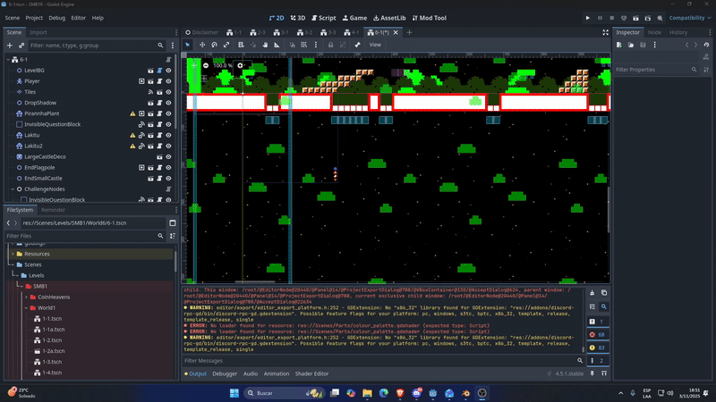

# Unzip windows 32 bits.zip

## It works on computers that do not support SSE4, for example, a Core2Quad 8200G in zorinOS with Wine.

## There is also a detail with the size of the window, it does not stretch, I don't know if it is a Godot configuration of window management.

## Godot export details
